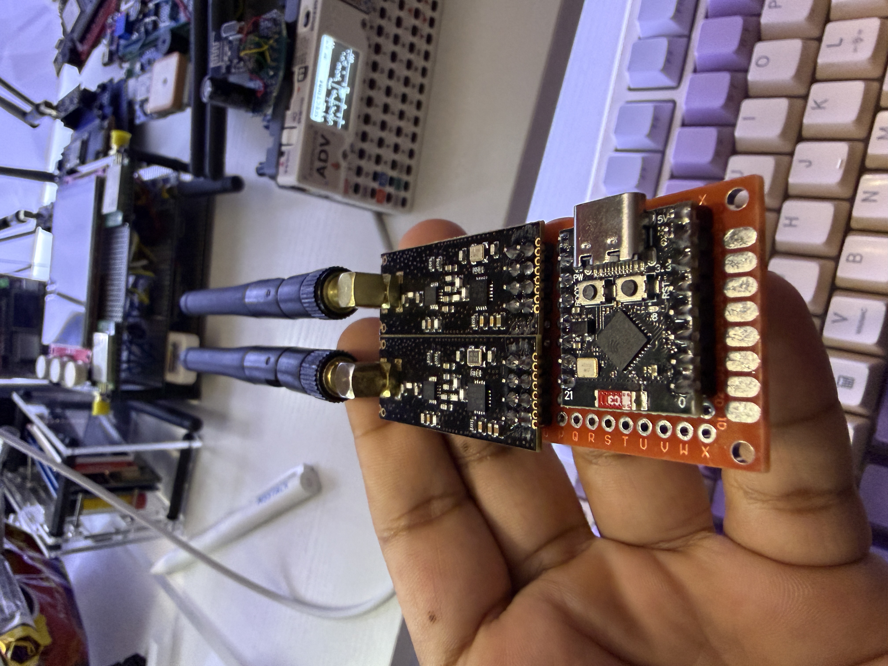
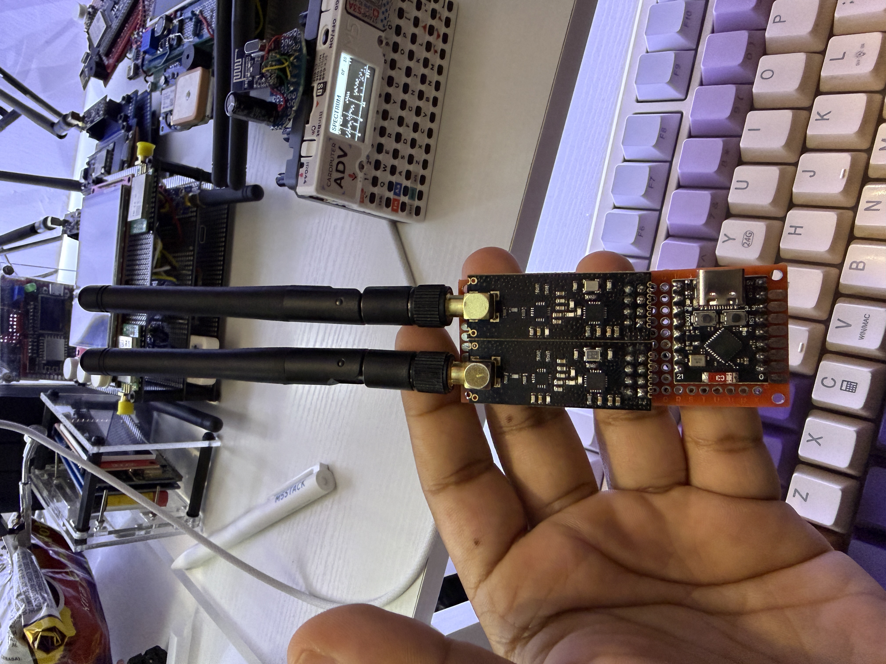
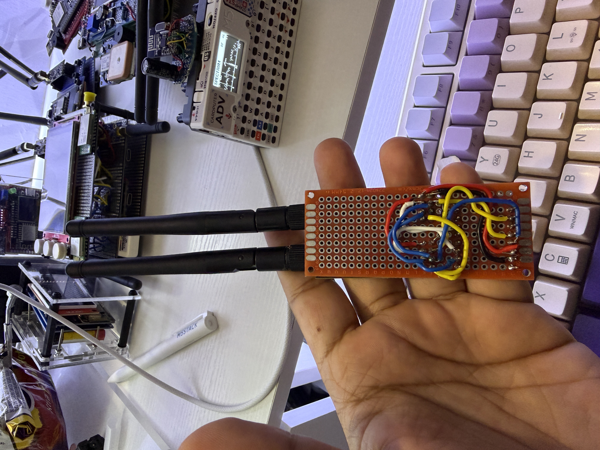
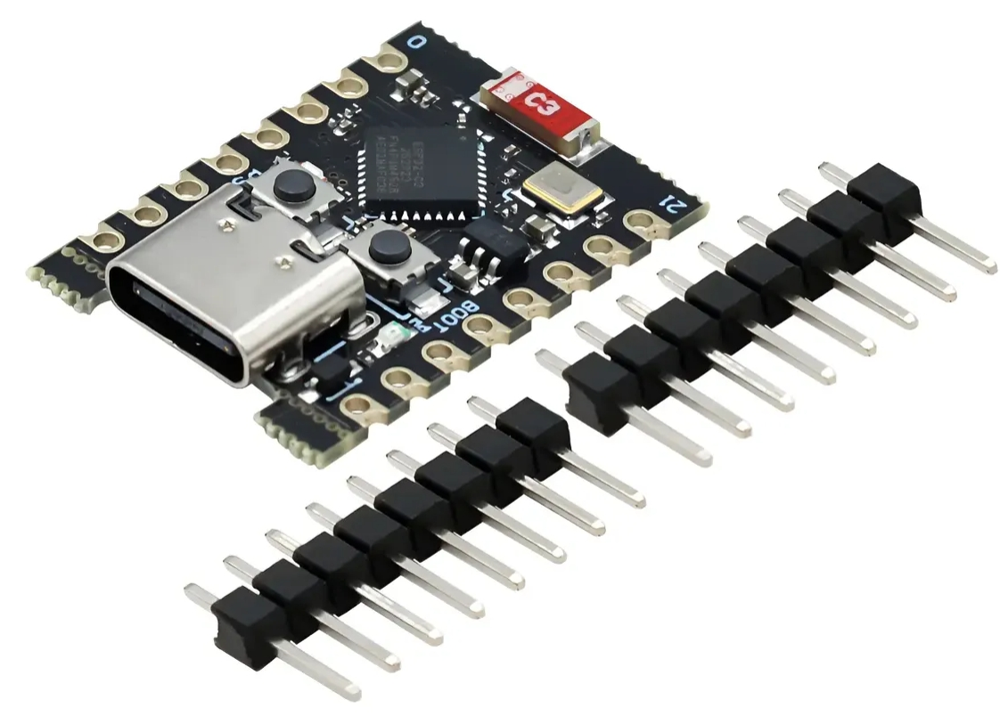
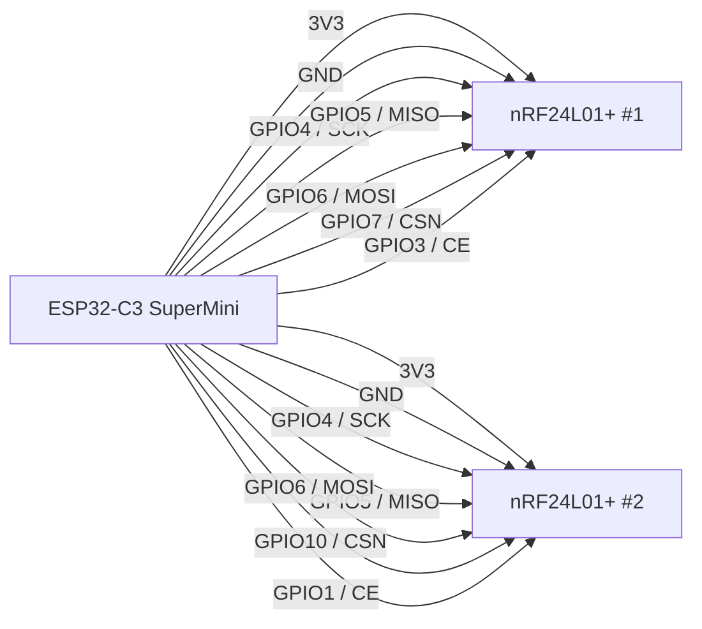
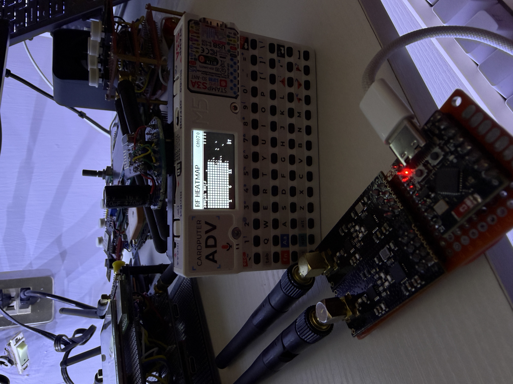
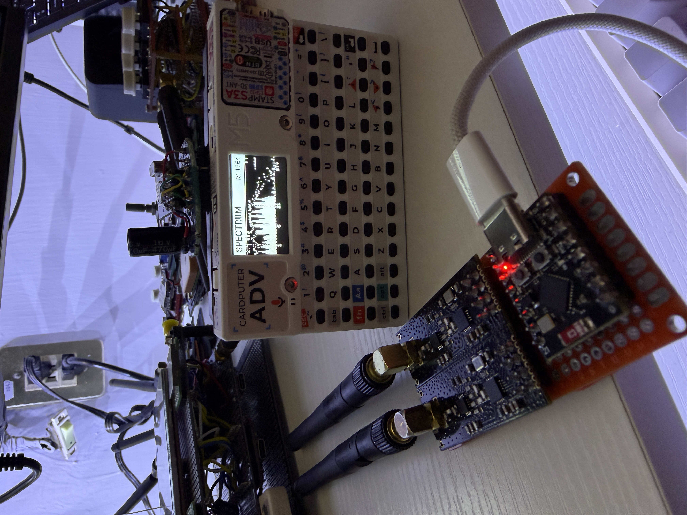

# RF-KILL ESP32-C3 SuperMini


Proyecto de tesis basado en un ESP32-C3 SuperMini y dos modulos nRF24L01+. Esta version adapta el firmware original de un ESP32 con pantalla OLED y botones a una ejecucion **headless**: sin pantalla, sin botones y con arranque automatico al energizar la placa desde USB, powerbank, bateria o cargador de pared.

> Uso previsto: demostracion academica, laboratorio controlado y practicas autorizadas de electronica/RF. Respeta siempre la normativa local y usa el proyecto solo en entornos permitidos.

## Indice

- [Vista General](#vista-general)
- [Caracteristicas](#caracteristicas)
- [Hardware](#hardware)
- [Conexiones](#conexiones)
- [Estructura Del Proyecto](#estructura-del-proyecto)
- [Configuracion De Pines En Codigo](#configuracion-de-pines-en-codigo)
- [Compilacion Con PlatformIO](#compilacion-con-platformio)
- [Metodos De Flasheo](#metodos-de-flasheo)
- [Web Flasher](#web-flasher)
- [Galeria](#galeria)
- [Solucion De Problemas](#solucion-de-problemas)
- [Redes Sociales](#redes-sociales)
- [Licencia](#licencia)

## Vista General

<p align="center">
  
  
  
</p>

[Regresar al indice](#indice)

## Caracteristicas

| Estado | Caracteristica |
| --- | --- |
|  | Arranque automatico al encender el ESP32-C3. |
|  | Firmware sin dependencia de pantalla OLED. |
|  | Firmware sin dependencia de botones fisicos. |
|  | Dos nRF24L01+ en bus SPI compartido. |
|  | Diagnostico por Monitor Serie a `115200` baudios. |
|  | Web Flasher incluido para instalacion desde navegador compatible. |

[Regresar al indice](#indice)

## Hardware

| Componente | Cantidad | Notas |
| --- | ---: | --- |
| ESP32-C3 SuperMini | 1 | Placa principal del proyecto. |
| nRF24L01+ | 2 | Modulos RF conectados al mismo bus SPI. |
| Capacitor 10 uF a 100 uF | 2 | Recomendado entre VCC y GND de cada nRF24. |
| Jumpers Dupont | Varios | Para SPI, CE, CSN, 3V3 y GND. |
| Fuente USB / powerbank | 1 | Alimentacion de la placa. |

<p align="center">
  
  
  
</p>

[Regresar al indice](#indice)

## Conexiones

Los dos nRF24L01+ comparten `SCK`, `MISO` y `MOSI`. Cada modulo usa su propio `CE` y `CSN`.

| Senal nRF24L01+ | ESP32-C3 SuperMini | Uso |
| --- | --- | --- |
| VCC | 3V3 | Alimentacion del modulo. |
| GND | GND | Tierra comun. |
| SCK | GPIO4 | SPI Clock compartido. |
| MISO | GPIO5 | SPI MISO compartido. |
| MOSI | GPIO6 | SPI MOSI compartido. |
| CSN nRF24 #1 | GPIO7 | Chip Select del modulo 1. |
| CE nRF24 #1 | GPIO3 | Chip Enable del modulo 1. |
| CSN nRF24 #2 | GPIO10 | Chip Select del modulo 2. |
| CE nRF24 #2 | GPIO1 | Chip Enable del modulo 2. |



<p align="center">
  
</p>

[Regresar al indice](#indice)

## Estructura Del Proyecto

```text
.
|-- binarios/
|   |-- boot_app0.bin
|   |-- bootloader.bin
|   |-- firmware.bin
|   `-- partitions.bin
|-- include/
|   |-- bt_jammer.h
|   |-- bt_jammer_hardware.h
|   `-- hardware_pins.h
|-- img/
|-- src/
|   |-- bt_jammer.cpp
|   |-- bt_jammer_hardware.cpp
|   `-- main.cpp
|-- index.html
|-- manifest.json
|-- platformio.ini
`-- README.md
```

[Regresar al indice](#indice)

## Configuracion De Pines En Codigo

Los pines usados por el firmware se encuentran en `include/hardware_pins.h`.

```cpp
static const uint8_t NRF24_SCK_PIN = 4;
static const uint8_t NRF24_MISO_PIN = 5;
static const uint8_t NRF24_MOSI_PIN = 6;

static const uint8_t NRF24_1_CSN_PIN = 7;
static const uint8_t NRF24_1_CE_PIN = 3;

static const uint8_t NRF24_2_CSN_PIN = 10;
static const uint8_t NRF24_2_CE_PIN = 1;
```

[Regresar al indice](#indice)

## Compilacion Con PlatformIO

Requisitos:

- Visual Studio Code
- Extension PlatformIO
- Cable USB de datos
- ESP32-C3 SuperMini

Compilar:

```bash
pio run
```

Subir por USB:

```bash
pio run --target upload
```

Monitor Serie:

```bash
pio device monitor --baud 115200
```

[Regresar al indice](#indice)

## Metodos De Flasheo

### 1. PlatformIO

Metodo recomendado durante desarrollo:

```bash
pio run --target upload
```

### 2. Web Flasher

El repositorio incluye `index.html`, `manifest.json` y los binarios necesarios en `binarios/`.

Cuando el repositorio este publicado en GitHub Pages, el instalador quedara disponible en:

[https://pepeangell5.github.io/RF-KILL/](https://pepeangell5.github.io/RF-KILL/)

Pasos:

1. Abre el enlace en Chrome o Edge de escritorio.
2. Conecta el ESP32-C3 SuperMini por USB.
3. Presiona **Instalar firmware**.
4. Selecciona el puerto serial del ESP32-C3.
5. Espera a que termine el flasheo.

### 3. esptool.py

Tambien puedes flashear manualmente con los binarios incluidos:

```bash
esptool.py --chip esp32c3 --baud 460800 write_flash -z \
  0x0000 binarios/bootloader.bin \
  0x8000 binarios/partitions.bin \
  0xe000 binarios/boot_app0.bin \
  0x10000 binarios/firmware.bin
```

Offsets usados por el Web Flasher:

| Archivo | Offset |
| --- | ---: |
| `bootloader.bin` | `0x0000` |
| `partitions.bin` | `0x8000` |
| `boot_app0.bin` | `0xe000` |
| `firmware.bin` | `0x10000` |

[Regresar al indice](#indice)

## Web Flasher

El archivo `manifest.json` apunta a:

```json
{
  "chipFamily": "ESP32-C3",
  "parts": [
    { "path": "binarios/bootloader.bin", "offset": 0 },
    { "path": "binarios/partitions.bin", "offset": 32768 },
    { "path": "binarios/boot_app0.bin", "offset": 57344 },
    { "path": "binarios/firmware.bin", "offset": 65536 }
  ]
}
```


[Regresar al indice](#indice)

## Galeria

<p align="center">
  
  
</p>

[Regresar al indice](#indice)

## Solucion De Problemas

| Problema | Revision recomendada |
| --- | --- |
| El ESP32-C3 no aparece en el navegador | Usa Chrome/Edge de escritorio y un cable USB de datos. |
| PlatformIO no detecta la placa | Revisa driver USB, puerto COM y cable. |
| nRF24 muestra `FALLO` | Revisa 3V3, GND comun, MISO/MOSI y capacitores. |
| Reinicios al arrancar | Usa alimentacion estable y capacitores cerca de cada nRF24. |
| Web Flasher no descarga binarios | Verifica que GitHub Pages publique `binarios/` y `manifest.json`. |

[Regresar al indice](#indice)

## Redes Sociales

| Red | Enlace |
| --- | --- |
| Facebook | [esp32-tools](https://www.facebook.com/esp32-tools) |
| Instagram | [pepeangelll](https://www.instagram.com/pepeangelll/) |
| YouTube | [esp32-tools](https://www.youtube.com/@esp32-tools) |
| Pagina web | [pepeangell.dev](https://pepeangell.dev) |

[Regresar al indice](#indice)

## Licencia

Este proyecto se distribuye bajo licencia MIT. Consulta `LICENSE` para mas detalles.

[Regresar al indice](#indice)
