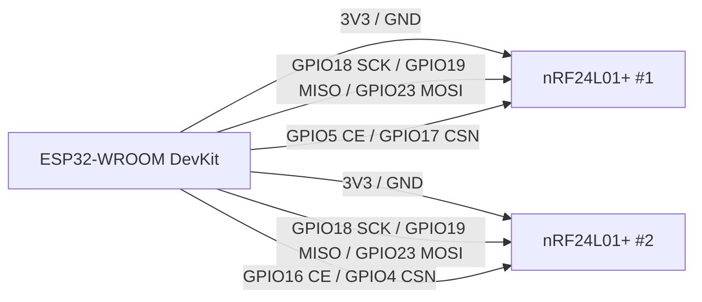

# RF-KILL ESP32-WROOM DevKit V2.0


Proyecto de tesis basado en un ESP32-WROOM DevKit y dos modulos nRF24L01+ conectados al mismo bus SPI. Esta version conserva dos formas de trabajo: un proyecto PlatformIO como metodo principal y un sketch `.ino` como alternativa para Arduino IDE.

> Uso previsto: demostracion academica, laboratorio controlado y practicas autorizadas de electronica/RF. Respeta siempre la normativa local y usa el proyecto solo en entornos permitidos.

## Indice

- [Vista General](#vista-general)
- [Hardware](#hardware)
- [Conexiones](#conexiones)
- [Estructura Del Proyecto](#estructura-del-proyecto)
- [Configuracion De Pines En Codigo](#configuracion-de-pines-en-codigo)
- [Uso Con PlatformIO](#uso-con-platformio)
- [Uso Con Arduino IDE](#uso-con-arduino-ide)
- [Binarios Y Web Flasher](#binarios-y-web-flasher)
- [Galeria](#galeria)
- [Solucion De Problemas](#solucion-de-problemas)
- [Redes Sociales](#redes-sociales)
- [Agradecimientos](#agradecimientos)
- [Licencia](#licencia)

## Vista General

<p align="center">
  
  
</p>

El montaje usa dos radios nRF24L01+ con `SCK`, `MISO` y `MOSI` compartidos. Cada modulo conserva sus propios pines `CE` y `CSN`, lo que permite controlarlos de forma independiente desde el ESP32.

[Regresar al indice](#indice)

## Hardware

| Componente | Cantidad | Notas |
| --- | ---: | --- |
| ESP32-WROOM DevKit | 1 | Placa principal del proyecto. |
| nRF24L01+ | 2 | Modulos RF conectados al mismo bus SPI. |
| Capacitor 10 uF a 100 uF | 2 | Recomendado entre VCC y GND de cada nRF24. |
| Jumpers Dupont | Varios | Para SPI, CE, CSN, 3V3 y GND. |
| Fuente USB / powerbank | 1 | Alimentacion de la placa. |

<p align="center">
  
  
  
</p>

[Regresar al indice](#indice)

## Conexiones

| Pin nRF24L01+ | ESP32-WROOM DevKit | Nota |
| --- | --- | --- |
| VCC | 3V3 | Nunca alimentar con 5V. |
| GND | GND | Tierra comun. |
| SCK | GPIO18 | SPI clock compartido. |
| MISO | GPIO19 | SPI MISO compartido. |
| MOSI | GPIO23 | SPI MOSI compartido. |
| CE nRF24 #1 | GPIO5 | Control del primer nRF. |
| CSN nRF24 #1 | GPIO17 | Chip select del primer nRF. |
| CE nRF24 #2 | GPIO16 | Control del segundo nRF. |
| CSN nRF24 #2 | GPIO4 | Chip select del segundo nRF. |



<p align="center">
  
</p>

[Regresar al indice](#indice)

## Estructura Del Proyecto

```text
.
|-- RF-KILL-Para arduino IDE/
|   `-- RF-KILL.ino
|-- binarios/
|   `-- README.md
|-- img/
|   |-- 2NRF24.png
|   |-- conexiones-devkit.jpg
|   |-- esp32U.png
|   |-- NRF24.png
|   `-- Pines-NRF24.png
|-- src/
|   `-- main.cpp
|-- index.html
|-- manifest.json
|-- PINOUT_ESP32_DEVKIT_NRF24.md
|-- platformio.ini
|-- LICENSE
`-- README.md
```

Notas:

- `src/main.cpp` es la version principal para PlatformIO.
- `RF-KILL-Para arduino IDE/RF-KILL.ino` conserva una version para Arduino IDE.
- `.pio/` y `.vscode/` son carpetas locales generadas por PlatformIO/VS Code y no forman parte del codigo fuente principal.

[Regresar al indice](#indice)

## Configuracion De Pines En Codigo

En la version PlatformIO, los pines estan definidos directamente en `src/main.cpp`:

```cpp
RF24 radioA(5, 17, 19909090);
RF24 radioB(16, 4, 19909090);
sp->begin(18, 19, 23);
```

En la version Arduino IDE, la misma configuracion esta en:

```text
RF-KILL-Para arduino IDE/RF-KILL.ino
```

[Regresar al indice](#indice)

## Uso Con PlatformIO

Requisitos:

- Visual Studio Code
- Extension PlatformIO
- Cable USB de datos
- ESP32-WROOM DevKit

Configuracion principal:

```ini
[env:esp32-devkit]
platform = espressif32
board = esp32dev
framework = arduino
monitor_speed = 115200
upload_speed = 460800
lib_deps =
    nrf24/RF24 @ ^1.4.7
```

Compilacion:

```bash
pio run
```

Monitor serie:

```bash
pio device monitor --baud 115200
```

[Regresar al indice](#indice)

## Uso Con Arduino IDE

Tambien se incluye una version `.ino` para quienes prefieren Arduino IDE:

```text
RF-KILL-Para arduino IDE/RF-KILL.ino
```

Configuracion recomendada:

| Ajuste | Valor |
| --- | --- |
| Gestor de placas | `esp32 by Espressif Systems` |
| URL adicional | `https://raw.githubusercontent.com/espressif/arduino-esp32/gh-pages/package_esp32_index.json` |
| Placa | `ESP32 Dev Module` |
| Velocidad de monitor | `115200` |
| Libreria requerida | `RF24 by TMRh20` |

Si Arduino IDE pide que la carpeta tenga el mismo nombre que el archivo `.ino`, renombra temporalmente la carpeta del sketch a `RF-KILL`.

[Regresar al indice](#indice)

## Binarios Y Web Flasher

La carpeta `binarios/` esta reservada para artefactos generados:

```text
binarios/
|-- boot_app0.bin
|-- bootloader.bin
|-- firmware.bin
|-- partitions.bin
`-- rf-kill-esp32-devkit-web-v2.bin
```

El archivo `manifest.json` esta preparado para que el Web Flasher use una imagen unificada:

```json
{
  "chipFamily": "ESP32",
  "parts": [
    { "path": "binarios/rf-kill-esp32-devkit-web-v2.bin", "offset": 0 }
  ]
}
```

El archivo `index.html` contiene la interfaz del Web Flasher basada en `esp-web-tools`. Para que funcione desde GitHub Pages, deben existir `manifest.json` y los archivos dentro de `binarios/` en el repositorio publicado.

Web Flasher publicado:

[https://pepeangell5.github.io/RF-KILL-ESP32-DEVKIT/](https://pepeangell5.github.io/RF-KILL-ESP32-DEVKIT/)

[Regresar al indice](#indice)

## Galeria

<p align="center">
  
  
</p>

<p align="center">
  
  
  
</p>

[Regresar al indice](#indice)

## Solucion De Problemas

| Problema | Revision recomendada |
| --- | --- |
| PlatformIO no detecta la placa | Revisa driver USB, puerto COM y cable de datos. |
| Arduino IDE no reconoce ESP32 | Verifica la URL del gestor de placas e instala `esp32 by Espressif Systems`. |
| Error con `RF24.h` | Instala la libreria `RF24 by TMRh20`. |
| nRF24 no responde | Revisa 3V3, GND comun, MISO/MOSI y capacitores. |
| Reinicios al arrancar | Usa alimentacion estable y capacitores cerca de cada nRF24. |
| Web Flasher no descarga binarios | Verifica que `binarios/` y `manifest.json` esten publicados. |

[Regresar al indice](#indice)

## Redes Sociales

| Red | Enlace |
| --- | --- |
| Facebook | <a href="https://www.facebook.com/esp32-tools" target="_blank" rel="noopener noreferrer">esp32-tools</a> |
| Instagram | <a href="https://www.instagram.com/pepeangelll/" target="_blank" rel="noopener noreferrer">pepeangelll</a> |
| YouTube | <a href="https://www.youtube.com/@esp32-tools" target="_blank" rel="noopener noreferrer">esp32-tools</a> |
| Pagina web | <a href="https://pepeangell.dev" target="_blank" rel="noopener noreferrer">pepeangell.dev</a> |

[Regresar al indice](#indice)

## Agradecimientos

El codigo base fue tomado como referencia del repositorio [wirebits/nrfBlueNullifier](https://github.com/wirebits/nrfBlueNullifier). Esta version fue adaptada para los pines correspondientes del ESP32-WROOM DevKit usado en el proyecto: SPI compartido en GPIO18/GPIO19/GPIO23, nRF24 #1 en CE GPIO5 y CSN GPIO17, y nRF24 #2 en CE GPIO16 y CSN GPIO4.

[Regresar al indice](#indice)

## Licencia

Este proyecto se distribuye bajo licencia MIT. Consulta `LICENSE` para mas detalles.

[Regresar al indice](#indice)
